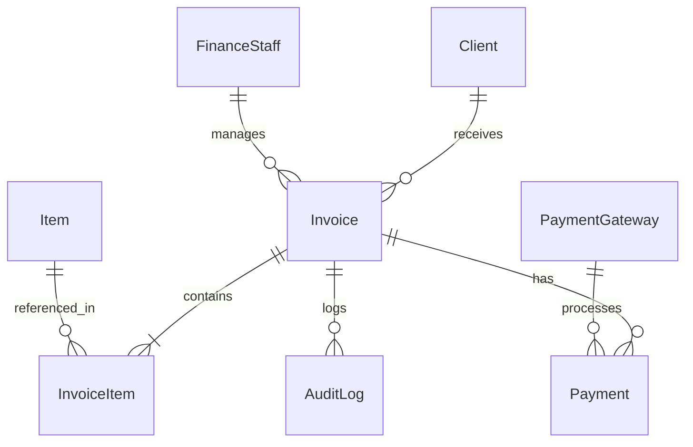

# IGPTS – Invoice Generation and Payment Tracking System

<div align="center">


**Bilingual Documentation | 中英双语**  
Click the sections below to switch languages · 点击下方模块切换语言

</div>

---

<details open>
<summary><b>🇺🇸 English</b></summary>

## Overview

**IGPTS** is an enterprise-grade invoice management web application built for SMEs. Developed with **ASP.NET Core 9.0 MVC**, it provides secure invoice lifecycle management, Stripe-based payment tracking, and real-time financial insights.

> **Desktop-first design:** Optimized for finance teams with dense data grids, audit trails, and reporting workflows on large screens.

## Screenshots

<div align="center">

### 📊 Dashboard


### 🧾 Invoice Management


</div>

## Key Features

### 1) Invoice Lifecycle (Domain-Driven)

- **State Machine:** Draft → Sent → Paid / Overdue
- **Business Rules Enforcement:** Once marked as _Sent_, invoice core fields are locked server-side
- **Soft Delete Strategy:** Records are archived instead of hard-deleted to meet audit requirements

### 2) Security, Compliance & Auditability

- **Role-Based Access Control (RBAC):** Admin, FinanceStaff, Client
- **GST Anti-Tampering Mechanism:**
  - Frontend enforces read-only constraints
  - Backend re-validates and overrides GST values using centralized `SystemSetting`
- **Audit Logging:** Every critical action (Create / Edit / Send / Delete) is recorded with user ID and timestamp

### 3) Automation & Background Processing

- **Hosted Services:** `InvoiceReminderService` runs on a scheduled background task to detect and flag overdue invoices
- **Status Synchronization:** Invoice state is automatically updated based on payment and due date

### 4) Payments & External Integrations

- **Stripe Integration:** Secure checkout flow for client-side payments
- **Webhook-Ready Architecture:** Designed to support asynchronous payment confirmation events
- **Email Notifications:** Automated invoice and reminder emails via MailKit

## Tech Stack

| Layer    | Technologies                           |
| -------- | -------------------------------------- |
| Backend  | .NET 9.0, ASP.NET Core MVC             |
| Data     | EF Core 9, SQL Server                  |
| Frontend | Bootstrap 5, jQuery, Chart.js          |
| Auth     | ASP.NET Core Identity (Roles & Claims) |
| Services | Stripe, MailKit, ClosedXML             |
| DevOps   | Dependency Injection, User Secrets     |

## Database (Simplified ERD)



## Architecture Overview

**IGPTS** follows a layered, enterprise-style architecture inspired by real-world financial systems:

- **Presentation Layer:** ASP.NET Core MVC (Controllers + Razor Views)
- **Application Layer:** Business logic, validation rules, background services
- **Domain Layer:** Core entities (Invoice, Payment, AuditLog) and state rules
- **Infrastructure Layer:** EF Core, SQL Server, Stripe, Mail services

Key architectural principles:

- Separation of Concerns (SoC)
- Dependency Injection throughout the system
- Centralized configuration for financial rules
- Audit-first design mindset

---

## Getting Started

### Prerequisites

- Visual Studio 2022 (17.12+)
- .NET 9.0 SDK
- SQL Server / LocalDB

### Installation

```bash
git clone https://github.com/yourusername/IGPTS.git
```

Configure **User Secrets** or `appsettings.json`:

- `ConnectionStrings:DefaultConnection`
- `Stripe:SecretKey`
- `EmailSettings`

Run `SADFinalProjectGJ.sln` (F5). The **DbInitializer** creates the database and seeds default users automatically.

### Default Accounts

| Role   | Email            | Password     |
| ------ | ---------------- | ------------ |
| Admin  | admin@igpts.com  | Password123! |
| Staff  | staff@igpts.com  | Password123! |
| Client | client@igpts.com | Password123! |

</details>

---

<details>
<summary><b>🇨🇳 中文</b></summary>

## 项目简介

**IGPTS** 是一套面向中小企业的企业级发票管理系统，基于 **ASP.NET Core 9.0 MVC** 构建，集成 Stripe 支付、后台自动化任务与实时财务分析。

> **桌面端优先：** 面向财务人员，强调高密度数据表格与审计可追溯性。

## 核心功能

### 1）发票生命周期

- 状态流转：草稿 → 已发送 → 已支付 / 逾期
- 后端锁定：发送后不可篡改
- 软删除：满足审计与合规需求

### 2）安全与合规

- RBAC 权限模型：管理员 / 财务 / 客户
- GST 防篡改：前后端双重校验
- 审计日志：完整记录关键操作

### 3）自动化与支付

- 后台服务自动标记逾期发票
- Stripe 在线支付
- 数据种子自动初始化系统配置

## 技术栈

| 模块 | 技术                         |
| ---- | ---------------------------- |
| 后端 | .NET 9.0, ASP.NET Core MVC   |
| 数据 | EF Core 9, SQL Server        |
| 前端 | Bootstrap 5, Chart.js        |
| 鉴权 | ASP.NET Core Identity        |
| 服务 | Stripe / MailKit / ClosedXML |

## 快速开始

```bash
git clone https://github.com/yourusername/IGPTS.git
```

配置连接字符串与密钥后，直接运行解决方案即可（DbInitializer 会自动建库与初始化账号）。

</details>

---

## Design Decisions

- **Why Soft Delete?**  
  Financial records must remain traceable for audits and compliance. Soft deletion preserves history without polluting active datasets.

- **Why Lock Invoices After Sending?**  
  Prevents retroactive manipulation of financial documents, aligning with real accounting workflows.

- **Why Centralized GST Validation?**  
  Tax values are treated as system-level configuration to prevent client-side tampering.

## Production Readiness Notes

This project is designed to resemble a real internal enterprise system:

- Supports role separation between finance staff and clients
- Designed for extensibility (multi-currency, multi-tenant, approval flows)
- Background services and audit trails reflect production-grade patterns

---

<p align="center">Built as an enterprise-style financial system demonstration project</p>
